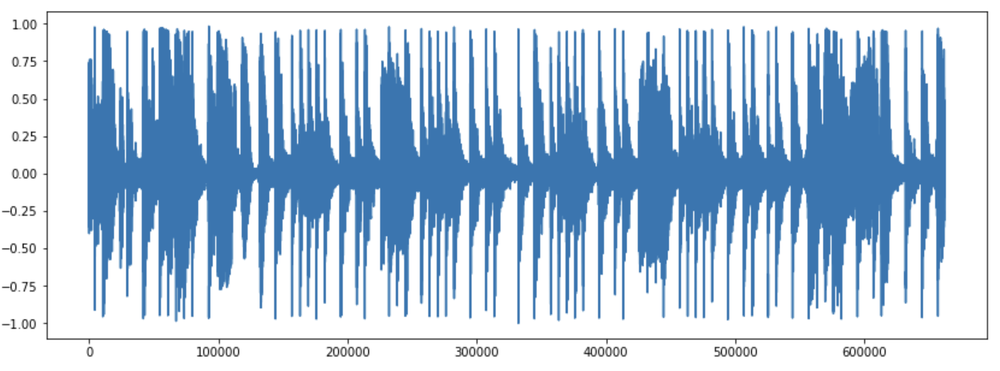

# Music Genre Classification

This repo contains code to train a classification model to classify music genres from a music sample. Model supports 10 genres: blues, classical, country, disco, hiphop, jazz, metal, pop, reggae and rock.   
   
## Using the repository
- Clone the repository
- Create a Python environment using Conda or Venv
- Install requirements from requirements.txt
- Prepare the dataset (See dataset format in data preparation section)

## Data Preparation
Dataset must be stored in tfrecords with:
- label (String): genre label of the sample
- waveform (FloatList): list of float values of the sample   

## Config Preparation
Training configs can be updated in configs/config.yaml. Hydra is used for configuration management.

## Data Preprocessing
Three types of data preprocessings are used:
- Spectrogram
- Melspectrogram
- MFCC 

## Model Architectures
EfficientNet is used as backbone for all the architectures used in the experiments with 3 variations of head architectures.   
   
Three types of head architectures used are:
- Stack of Linear Layers
- PRCNN
- Vision transformers

## Sanity Checks
Before training, data samples, model architectures and hyperparameters can be checked using scripts provided.
- show_sample.py to visualize a training sample after applying data preprocessing
- show_config.py to check hyperparameters set in configs/config.yaml
- show_model.py to check the model architecture
- show_lrfn.py to check the learning rate schedule

## Training
After configuring the hyperperameters and checking everything using sanity check scripts, python run **train.py** to start training. Checkpoints will be saved at the directory specified in the config.yaml.

## Testing
python run **test.py** to evaluate the model.

## Inference
python run **inference.py** to inference the trained model on test samples.

## Model exporting
python run **export.py** to export the model from a trained checkpoint.
